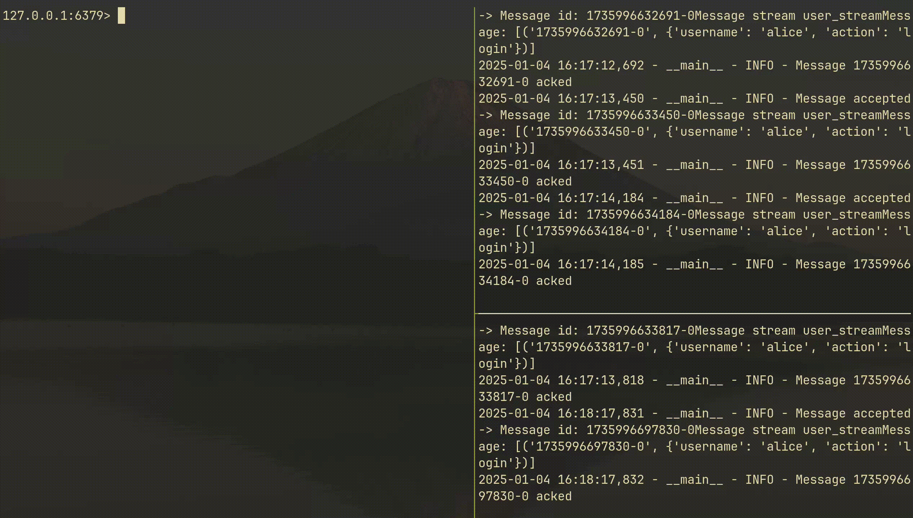

# Redis Streams Consumer Service
An example of an asynchronous Python service designed to process messages from Redis Streams


### **Key Features:**
- **Connection to Redis Streams:** Supports the creation and use of consumer groups for efficient load distribution across multiple consumer instances.
- **Graceful Shutdown:** Proper handling of system signals (`SIGINT`, `SIGTERM`) for safe termination, preventing data loss and ensuring connection closures.
- **Logging:** Integrated logging system with various message levels (`INFO`, `WARNING`, `ERROR`), simplifying monitoring and debugging of the service's operation.
- **Error Handling:** Reliable exception handling with detailed logs, ensuring the application's resilience against unexpected failures.
- **Message Acknowledgment (`XACK`):** Ensures that each message is processed only once, preventing duplication.

### **Technologies and Tools:**
- **Python 3.8+**
- **asyncio:** For implementing asynchronous interactions with Redis and message processing.
- **redis-py:** Asynchronous client for interacting with Redis Streams.
- **logging:** For configuring and managing the logging system.
- **argparse:** For parsing command-line arguments, allowing flexible configuration of Redis connection parameters.

### **Installation and Setup:**
1. **Install Dependencies:**
    ```bash
    poetry install
    ```
2. **Run the Consumer:**
    ```bash
    poetry run python3 consumer.py --host <REDIS_HOST> --port <REDIS_PORT> --stream_name <STREAM_NAME> --group_name <GROUP_NAME>
    ```
    By default, the parameters take the following values:
    - `host`: `localhost`
    - `port`: `6379`
    - `stream_name`: `user_stream`
    - `group_name`: `user_group`![Screencast-from-2025-01-04-16-18-33-_online-video-cutter com_]


### **Usage Example:**
After starting the consumer, it will listen to the specified Redis Stream and process incoming messages, acknowledging their receipt. To add messages, you can use `redis-cli`:
```bash
redis-cli XADD user_stream * username "alice" action "login"
redis-cli XADD user_stream * username "bob" action "logout"
```
